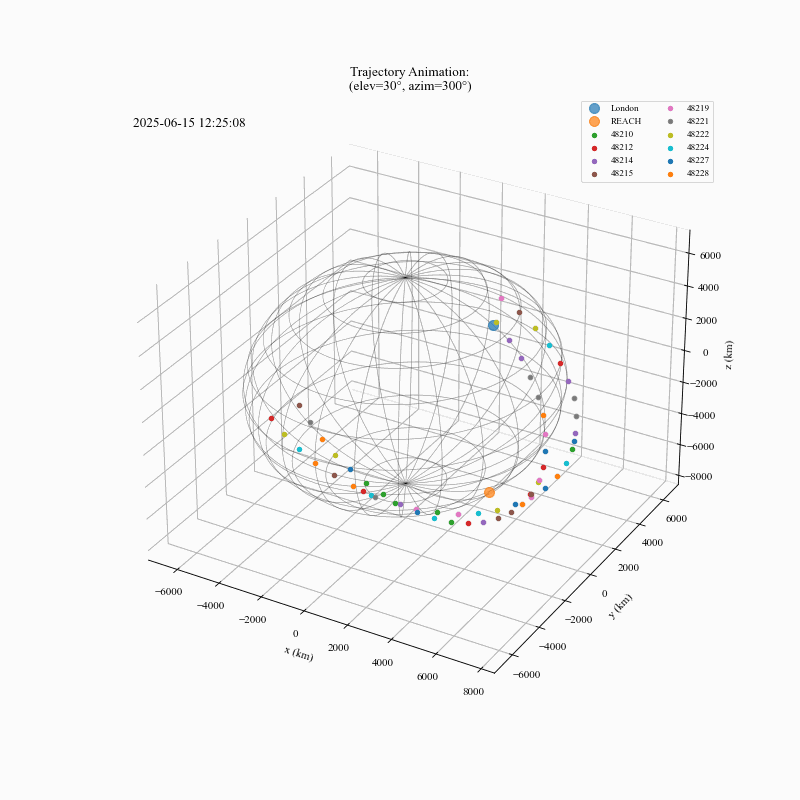
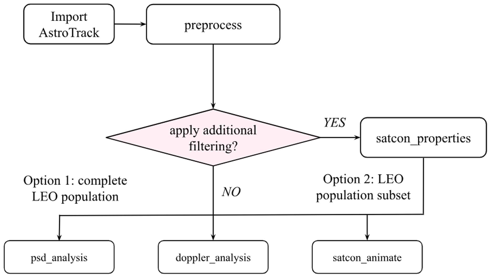

AstroTrack
===========

**AstroTrack** is a Python package for characterising Low Earth Orbit (LEO) satellite interference in wide-field radio astronomy observations. It provides tools for processing TLEs, selecting flyovers, analysing satellite properties, computing Doppler shifts, temporally comparing satellite metrics with generated Power Spectral Density (PSD) plots, and creating animations of satellite trajectories as shown below.

<br>
<div align="center">
  
</div>
<br>

---

Installation
------------

AstroTrack can be installed from PyPI:

```bash
pip install astrotrack
```
To alternatively install from source:

```bash
git clone https://github.com/Gabriella8080/AstroTrack.git
cd astrotrack
pip install -e ".[dev]"
```
---

Modules Overview
----------

**AstroTrack** is organised into five core modules, where the package begins with initialising and structuring satellite Two-Line Element (TLE) data for analysis. The other subsequent modules build up on this to derive orbital properties, Doppler behaviour with respect to a ground-based experiment, animations, and enabling spectral associations.
<br>
<div align="center">
  
</div>
<br>

- **`preprocess`**: Load and filter satellite TLE data.
- **`satcon_properties`**: Filter, analyse, and visualise satellite trajectories as well as their metrics. 
- **`doppler_analysis`**: Evaluate Doppler shifts and detectability.
- **`satcon_animate`**: Generate 3D trajectory animations.
- **`psd_analysis`**: Visualise satellite flyovers with spectral data.

We provide a brief overview of all five modules, their key functions, and example usage [here](docs/examples/examples.md).

---

Quick Start
----------

```python
from datetime import datetime
from astrotrack.preprocess import load_satellite_data

data = load_satellite_data(
    tle_file="LEO_TLE_file.txt",
    target_date=datetime(2025, 1, 18, 12, 25, 8),
    obs_len=3600, 
    traj_res=60,
    obs_lat=51.5,
    obs_lon=-0.1,
    R=2000,
    horizon_data="Horizon-Profile.csv", 
    satcon="STARLINK"
)
```

> **Generating Epoch Times with Skyfield**: The following code can be used to initialise a time array for satellite propagation.
>
>```python
>import numpy as np
>from skyfield.api import load
>
># Create a timescale object:
>ts = load.timescale()
>
># Define orbit duration:
>orbit_duration = np.arange(0, 3600, 1)  # in seconds
>
># Generate time array:
>epochs_of_orbit = ts.utc(2025, 1, 1, 10, 15, 0 + orbit_duration)
>```
>

---

Example Workflow:
----------
Please refer to [this workflow](docs/examples/example_script.py) for a more comprehensive demonstration using **AstroTrack**, including usage of an example [horizon profile](docs/examples/REACH-Horizon.csv) from the REACH experiment ([de Lera Acedo et al.](https://doi.org/10.1038/s41550-022-01709-9)) and a [TLE catalogue](docs/examples/LEO-catalogue.txt) compiled from [Space-Track](www.space-track.org). 

A [baseline horizon profile](docs/baseline_horizon.csv) corresponding to an idealised flat horizon is also provided. This can be used directly, or modified by the user to incorporate site-specific observational constraints.
